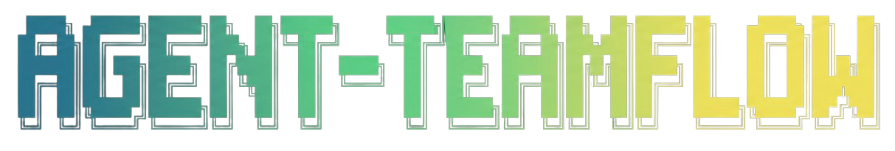
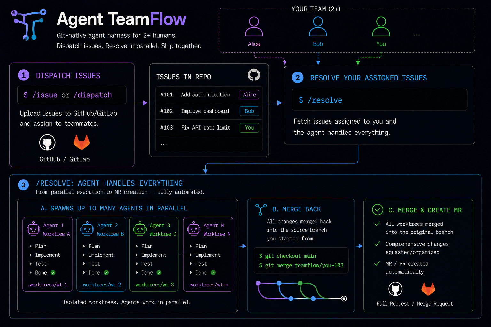
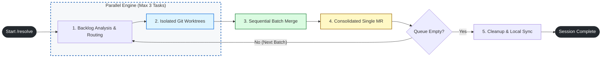

#  agent-teamflow — Team level harness

<p align="center">
  
</p>

<p align="center">
  <strong>PARALLEL AGENTS, ZERO COLLISIONS</strong>
</p>

<p align="center">
  <a href="LICENSE"></a>
  
  
  
  
  
</p>

**agent-teamflow** is a _team layer for coding agents_ that ships with your repo.
It is a config file, a branching convention, and nine workflows that let two or more developers' agents file separate issues, push to separate branches, and merge cleanly into shared staging — without coordinating manually.

If you want multiple developers running coding agents on the same repo in parallel without stomping on each other, this is it.

Supported agents: **Claude Code**, **Codex**. Supported issue trackers: **GitHub** (`gh` CLI), **GitLab** (`glab` CLI).

[Setup](SETUP.md) · [Examples](examples/) · [Contributing](CONTRIBUTING.md) · [Changelog](CHANGELOG.md) · [Protocol (AGENTS.md)](AGENTS.md) · [License](LICENSE)

## See it work

<p align="center">
  
</p>

Two developers, two terminals, zero coordination:

```
┌─ alice@laptop ────────────────────────┐  ┌─ bob@laptop ──────────────────────────┐
│ $ claude                              │  │ $ claude                              │
│ > /resolve                            │  │ > /resolve                            │
│                                       │  │                                       │
│ Picked issues #5, #6.                 │  │ Picked issues #8, #9.                 │
│ Starting 2 workers in worktrees off   │  │ Starting 2 workers in worktrees off   │
│ origin/alice-staging.                 │  │ origin/bob-staging.                   │
│                                       │  │                                       │
│   #5  → 5-checkout-validation  done   │  │   #8  → 8-pagination          done   │
│   #6  → 6-payment-receipts     done   │  │   #9  → 9-health-check        done   │
│                                       │  │                                       │
│ PR #10: alice-staging → staging       │  │ PR #11: bob-staging → staging         │
└───────────────────────────────────────┘  └───────────────────────────────────────┘
                              \                 /
                               v               v
                          ┌────────────────────────┐
                          │     origin/staging     │
                          └────────────────────────┘
```

## Install (recommended)

Two install paths. **For team repos, vendor agent-teamflow into the repo** so everyone gets the same version automatically:

```bash
git clone --depth 1 https://github.com/lkim0402/agent-teamflow.git .agent-teamflow-tmp \
  && cp -r .agent-teamflow-tmp/.claude .agent-teamflow-tmp/.codex .agent-teamflow-tmp/AGENTS.md . \
  && ln -sf AGENTS.md CLAUDE.md \
  && rm -rf .agent-teamflow-tmp

git add .claude .codex AGENTS.md CLAUDE.md && git commit -m "add agent-teamflow"
```

This adds `.claude/commands/`, `.codex/skills/`, `AGENTS.md`, and a `CLAUDE.md -> AGENTS.md` symlink to your repo. Claude Code picks up project-scope slash commands automatically. Codex picks up matching skills under `/skills`.

> **Already have a `.claude/` directory** with your own custom commands? `cp -r` will merge — inspect the result before committing.
>
> **Want to merge `AGENTS.md`** with an existing one? After the copy, manually combine the two and delete the conflict.

In your agent, run `/teamflow-init` to write `.agent-teamflow` (your team's config). Then commit that too.

## Quick start (TL;DR)

Full beginner guide (auth, branches, examples): [SETUP.md](SETUP.md).

Install globally for personal use (or for solo evaluation):

```bash
git clone --depth 1 https://github.com/lkim0402/agent-teamflow.git ~/.agent-teamflow \
  && ~/.agent-teamflow/setup --all
```

This installs **9 Claude Code slash commands** into `~/.claude/commands/` and **9 Codex skills** into `~/.codex/skills/`. Then, inside any repo:

```
/teamflow-init             # bootstrap this repo (writes .agent-teamflow)
/issue add a CSV exporter  # file one branch-sized issue from a brain dump
/resolve                   # pick up your assigned issues, implement in parallel
/git-auto-merge            # commit, push, merge into your lane, open PR
```

Upgrading? Run `/teamflow-update` from any agent. Or manually: `cd ~/.agent-teamflow && git pull && ./setup`.

Do not combine global and vendor installs for the same workflow. If a repo vendors `.codex/skills/*` and you also have `~/.codex/skills/*` for the same names, Codex may show duplicate skills in `/skills`. Prefer vendor mode for teams.

## Highlights

- **[Per-developer integration branches](#how-the-team-workflow-works)** — `feature → owner-staging → shared staging → main`. Each developer pushes only to their own lane.
- **[`/issue`](#what-you-get)** — turn a brain dump into branch-sized issues sized to avoid batch-merge conflicts.
- **[`/dispatch`](#what-you-get)** — split a brain dump across multiple teammates, write a workflow log, file issues for each.
- **[`/resolve`](#what-you-get)** — pick up your open issues, implement each in a parallel worktree (cap 3), batch-merge when done.
- **[`/git-auto-merge`](#what-you-get)** — commit → push → merge into your lane → open or update an MR/PR to shared staging.
- **[`/post-merge`](#what-you-get)** — after merging to staging, label linked issues as "done in staging". Auto-close fires on staging → main.
- **[`/prod-check`](#what-you-get)** — pre-production diff review scoped to your own commits: impact, contracts, auth, stability, regressions.
- **[Vendor or global install](#install-recommended)** — one committed copy for the whole team, or per-developer install for solo use.

## Security model

agent-teamflow workflows never push to `branches.main` directly — the branching model funnels everything through staging. Runbooks ship with explicit prohibitions:

- `/git-auto-merge` and `/resolve` refuse to delete branches or worktrees without per-turn explicit user approval.
- `/teamflow-init` only creates remote branches when the user clicks `Yes` in Step 7.
- `/post-merge` only labels issues; it never closes or merges anything.
- All workflows except the three lifecycle ones (`/teamflow-init`, `/teamflow-update`, `/teamflow-help`) refuse to run without `.agent-teamflow`.

Treat your issue tracker as the source of truth. Workflows are automation, not authority.

## Operator quick refs

- Slash commands (Claude Code): `/teamflow-init`, `/teamflow-update`, `/teamflow-help`, `/issue`, `/dispatch`, `/resolve`, `/git-auto-merge`, `/post-merge`, `/prod-check`
- Skills (Codex `/skills`): same names without the slash — `issue`, `resolve`, `dispatch`, …
- Owner resolution: `git config user.email` local part → `owners` map key → `<alias>-staging` branch
- Config schema reference: [SETUP.md](SETUP.md#agent-teamflow-config-reference)
- Shared protocol: [AGENTS.md](AGENTS.md)

## What you get

Nine workflows. Three are lifecycle (`/teamflow-init`, `/teamflow-update`, `/teamflow-help`); the rest are the actual team flow.

| Command | What it does |
|---|---|
| `/teamflow-init` | Bootstrap the current repo — writes `.agent-teamflow`, optionally creates integration branches |
| `/teamflow-update` | Pull the latest agent-teamflow and re-register slash commands |
| `/teamflow-help` | Print this list of commands (useful for teammates who just installed) |
| `/issue` | Turn a brain dump into branch-sized issues (sized to avoid merge conflicts) |
| `/dispatch` | Split a brain dump across multiple teammates, file issues, write a workflow log |
| `/resolve` | Pick open issues assigned to you, implement each in a parallel worktree, batch-merge when done |
| `/git-auto-merge` | Commit → push → merge into your lane → open MR/PR to staging |
| `/post-merge` | After merging an MR/PR, label linked issues as "done in staging" |
| `/prod-check` | Pre-production review of your recent commits — impact, contracts, auth, stability |

## How the team workflow works

Workflows read one config file (`.agent-teamflow`) at the repo root and adapt to your branching model. You describe your branches and who owns what — the workflows do the rest.

The minimum two-branch setup:

```
feature branches → staging → main
```

Personal integration branches (recommended for teams of 2+):

```
Alice's feature branches → alice-staging ─┐
                                           ├→ staging → main
Bob's feature branches   → bob-staging   ─┘
```

Personal lanes are the multiplayer primitive. Alice and Bob can both have multiple agents running, all pushing to their own lane, without ever pushing to a branch the other is also writing to. When work is ready, each lane merges into the shared `staging` via a normal PR.

If your team calls things differently — `develop` instead of `staging`, `master` instead of `main`, `alice/integration` instead of `alice-staging` — configure those names. Workflows don't care what the branches are called.

Here's how `/resolve` moves through a session:



## Vendor vs. global — which?

|  | Vendor (project-scope) | Global (user-scope) |
|---|---|---|
| Versions | Everyone on the team uses the same one (whatever's committed) | Each developer installs and updates independently |
| Onboarding | New hires get it on day 1 | New hires have to install themselves |
| Discoverability | `AGENTS.md`, `.claude/`, and `.codex/` are visible in the repo | Nothing in the repo says "we use this" |
| Repo footprint | Adds shared runtime dirs + 1 config | Just `.agent-teamflow` |
| Updates | Re-vendor when you want to pull upstream changes | `/teamflow-update` per developer |

Both modes use the same workflows and the same config schema. Pick one mode per user/repo.

## Examples

[`examples/`](examples/) — three narrative walkthroughs showing the same workflows under different team setups:

- **[`solo/`](examples/solo/)** — one developer, no personal lanes, features land on `staging` directly.
- **[`small-team/`](examples/small-team/)** — two developers with personal integration branches, parallel `/resolve` runs.
- **[`larger-team/`](examples/larger-team/)** — four developers sharing one `staging` branch, no personal lanes.

## Docs by goal

- New here: [SETUP.md](SETUP.md) — install paths in depth, troubleshooting, FAQ
- Examples: [Solo](examples/solo/), [Small team](examples/small-team/), [Larger team](examples/larger-team/)
- Contribute: [CONTRIBUTING.md](CONTRIBUTING.md) — adding a workflow, style rules, smoke tests
- Protocol: [AGENTS.md](AGENTS.md) — the shared protocol every workflow reads first
- History: [CHANGELOG.md](CHANGELOG.md)

## Compatibility

Each runtime entrypoint is self-contained. `AGENTS.md` is the shared protocol. `.claude/commands/*.md` contains the Claude Code slash commands; `.codex/skills/*/SKILL.md` contains the matching Codex skills. Each pair holds the full workflow content, so updating one means updating the other (see [CONTRIBUTING.md](CONTRIBUTING.md)).

## Configuration

Minimal `.agent-teamflow` (committed at the repo root):

```json
{
  "issueTracker": "github",
  "project": "your-org/your-repo",
  "branches": {
    "main": "main",
    "staging": "staging"
  },
  "owners": {
    "alice": "alice-staging",
    "bob": "bob-staging"
  }
}
```

[Full configuration reference (all keys + examples)](SETUP.md#agent-teamflow-config-reference).

## From source (development)

```bash
git clone https://github.com/lkim0402/agent-teamflow.git
cd agent-teamflow

# Install runtime adapters into an isolated test HOME
HOME=/tmp/at-test CODEX_HOME=/tmp/at-test-codex ./setup --all

# Verify generated files
ls /tmp/at-test/.claude/commands/
test -f /tmp/at-test-codex/skills/issue/SKILL.md

# Clean up
rm -rf /tmp/at-test /tmp/at-test-codex
```

See [CONTRIBUTING.md](CONTRIBUTING.md) for the conventions around adding new workflows.

## Origin

agent-teamflow grew out of running multiple Claude Code agents in parallel against the same team repo and watching them collide on shared branches. The little robot crew on the README is the visual shorthand — many agents, one repo, no merge-conflict horror.

## Community

Adding a workflow, fixing a runbook, or improving an example? See [CONTRIBUTING.md](CONTRIBUTING.md) for guidelines and PR conventions. Released under the [MIT License](LICENSE).

AI-coded PRs welcome.
